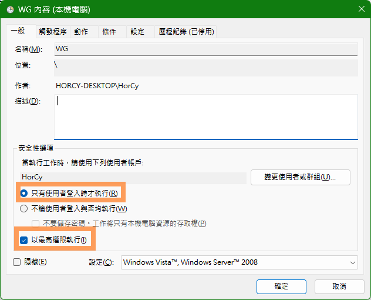
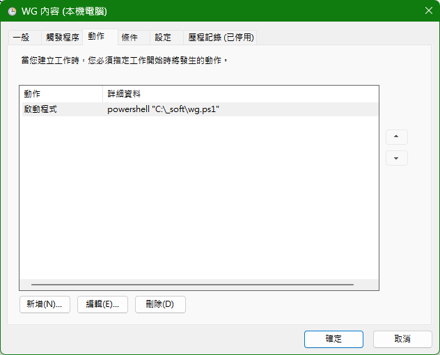

# WSL作為 WireGuard+NAT 中繼

無痛透過WSL 連接WireGuard來連線到高雄LAB
連線概念大概是這樣：
```
我的電腦 ---> VM1(NAT) ---------wireguard------->gateway----->server farm
```
具體會需要
- 設定WSL 安裝wireguard
- 設定wireguard的wg0 interface
- 開啟wg0
- 找到WSL對Win的IP
- 接著設定靜態路由

不過依照下面方式，可以節省許多手動設定的麻煩。
- 設定WSL 安裝wireguard
- 設定wireguard的wg0 interface
- 用Powershell腳本 :
	- 開啟WSL的wg0
	- 找到WSL對Win的IP
	- 接著設定靜態路由

## WSL設定
### 第一步：在 WSL2 內安裝 WireGuard

打開你的 WSL2 (Ubuntu)，執行：
```sh
sudo apt update
sudo apt install wireguard -y
```
### 第二步：配置 WireGuard (wg0.conf)

將你 Server Farm 給你的設定檔放入 `/etc/wireguard/wg0.conf`。

#### 公司Server提供的原始設定範例:
```ini
[Interface]
PrivateKey = <PrivateKey>
Address = <Address>
DNS = <DNS>

[Peer]
PublicKey = <PublicKey>
PresharedKey = <PresharedKey>
AllowedIPs = 0.0.0.0/0
Endpoint = <Endpoint>:<port>
PersistentKeepalive = 25
```
#### 修改後:
將`<tag>`中的值換成你的
記得`AllowedIPs`不要使用 `0.0.0.0/0`
```ini
[Interface]
# 你的原始私鑰與位址保持不變
PrivateKey = <PrivateKey>
Address = <Address>
#DNS = <DNS> 直接註解這個DNS吧 預設WSL吃不到這條設定 會導致ERROR

# --- 以下為新增的 NAT 還原策略指令 ---
# 當 wg0 啟動時，自動開啟 IP 轉發並設定 NAT 偽裝
PostUp = sysctl -w net.ipv4.ip_forward=1
PostUp = iptables -t nat -A POSTROUTING -o wg0 -j MASQUERADE
# 當 wg0 關閉時，自動清理 NAT 規則，保持系統乾淨
PostDown = iptables -t nat -D POSTROUTING -o wg0 -j MASQUERADE

[Peer]
PublicKey = L0P3T5EH6p7eAr3fnsQ5kiRc5Qfpkf7ktCFKpEsArns=
PresharedKey = P2TjKD46ZpnaMV7jIgrrbEpXQqlGVn+qM9pveMpMoUQ=

# --- 關鍵修改點：只允許 Server Farm 的網段通過隧道 ---
# 不要使用 0.0.0.0/0，否則你的WSL會斷網（因為所有流量都會被導向 VPN）
AllowedIPs = 192.168.100.0/24, 192.168.30.0/24, 10.5.5.0/24
Endpoint = 114.35.212.92:51820
PersistentKeepalive = 25
```
### 第三步：開啟VPN
嘗試開啟WireGuard VPN吧!! 
找個環境中的IP來ping看看有沒有通!!
```sh
sudo wg-quick up wg0
ping <ip>
```

## Win11設定
設定PS1指令並存檔，這要用系統管理員身分執行才會生效的。
以我舉例，我存檔為c:\_soft\wg.ps1
```powershell
### 1. 強制重啟 WSL2 內的 WireGuard (不管原本有沒有開，先關再開最乾淨)
wsl -u root bash -c "wg-quick down wg0; wg-quick up wg0"

### 2. 剩下的路由邏輯不變
route delete 192.168.100.0 2> $null
route delete 192.168.30.0 2> $null
$wslIp = ((wsl ip -4 addr show eth0 | Select-String -Pattern "inet\s+(\d{1,3}\.\d{1,3}\.\d{1,3}\.\d{1,3})").Matches.Groups[1].Value)
route add 192.168.100.0 mask 255.255.255.0 $wslIp
route add 192.168.30.0 mask 255.255.255.0 $wslIp
```



